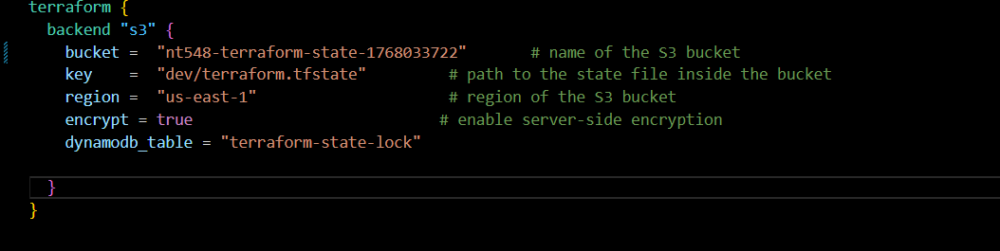

# Lab1_Infrastructure

### use
```bash
aws configure
```

### fill in:
AWS Access Key ID
AWS Secret Access Key
region name
output format  


### run s3
```bash
chmod +x scripts/setup-backend.sh
./scripts/setup-backend.sh
```

### change bucket name
